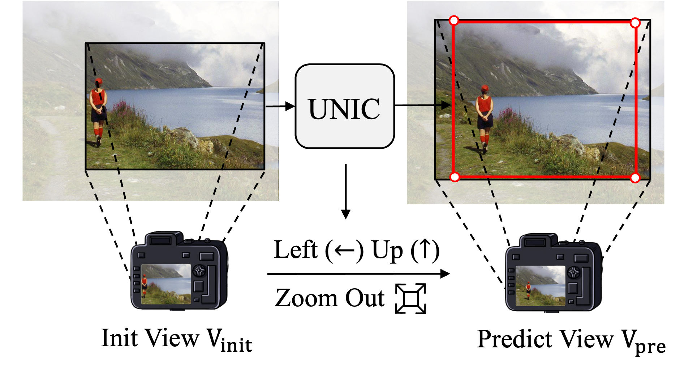

# UNIC

## Beyond Image Borders: Learning Feature Extrapolation for Unbounded Image Composition, ICCV 2023. 


we present a joint framework for both unbounded recommendation of camera view and image composition (i.e., UNIC). In this way, the cropped image is a sub-image of the image acquired by the predicted camera view, and thus can be guaranteed to be real and consistent in image quality. Specifically, our framework takes the current camera preview frame as input and provides a recommendation for view adjustment, which contains operations unlimited by the image borders, such as zooming in or out and camera movement. To improve the prediction accuracy of view adjustment prediction, we further extend the field of view by feature extrapolation. After one or several times of view adjustments, our method converges and results in both a camera view and a bounding box showing the image composition recommendation. Extensive experiments are conducted on the datasets constructed upon existing image cropping datasets, showing the effectiveness of our UNIC in unbounded recommendation of camera view and image composition. 

<div style="align: center">

</div>


## 1. Data Setup

We recreate an unbounded image composition dataset based on GAICD and adopts a cDETR-like encoder-decoder to train UNIC.
Before train or test, you need to download the GIAC dataset and generate annotations in the format of the COCO dataset.
1. GAIC Dataset: Visit [this page](https://drive.google.com/file/d/1tDdQqDe8dMoMIVi9Z0WWI5vtRViy01nR/view) to download the GAIC Dataset.
2. Annotations in format of COCO: Visit [this page](https://drive.google.com/drive/folders/1xkZFXOTV4zebm660Dgprl_yaKxWAHh0H?usp=drive_link) to download `instances_train.json` and `instances_test.json` and place them in the `GAIC/annotations` directory.
3. init_view: The file for initial views has been placed in the `init_view` directory


## 2. Training and evaluation


Training on your datasets, run:
```
bash train.sh
```

We also provide the pretrained model [here](https://drive.google.com/file/d/1owvtFQBCC4uxd5f6tRsh7Fgktuj8MzZy/view?usp=drive_link) so that you can fast-forward to test our method.

Evaluate on your datasets, run:
```
bash test.sh
```


## Acknowledgements

Our codes are built upon [pytorch-ema](https://github.com/lucidrains/ema-pytorch) and [ConditionalDETR](https://github.com/Atten4Vis/ConditionalDETR).

## Citation

